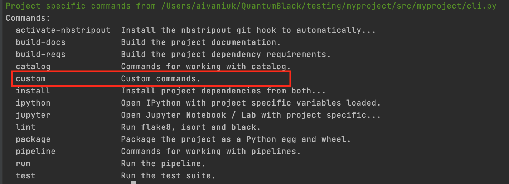

# How to add a custom CLI command

As the following steps explain, to add a new custom CLI command, you need to create a new `click` group, add a `@cli.command()` to that group and then register the new group with `cli` group defined in `src/<package_name>/cli.py`:

```python
# src/<package_name>/cli.py
...

@click.group()
def custom():
    """Custom commands."""

@custom.command()
def to_json():
    """ Display the pipeline in JSON format """
    package_name = str(Path(__file__).resolve().parent.name)
    with KedroSession.create(package_name) as session:
        context = session.load_context()
        print(context.pipeline.to_json())

...
cli.add_command(jupyter_group)
cli.add_command(custom)
...
```

Once you have made the modification, if you run `kedro -h` in your terminal, you see the new `custom` group.



Run the custom command:

```shell
$ kedro custom to-json
```

# Customise existing Kedro CLI

> Note: All the existing Kedro CLI commands are closed for modification.

The only possible way to extend an existing command is to create a new custom command as described in the previous section.

_[Go to the next page](./15_plugins.md)_

